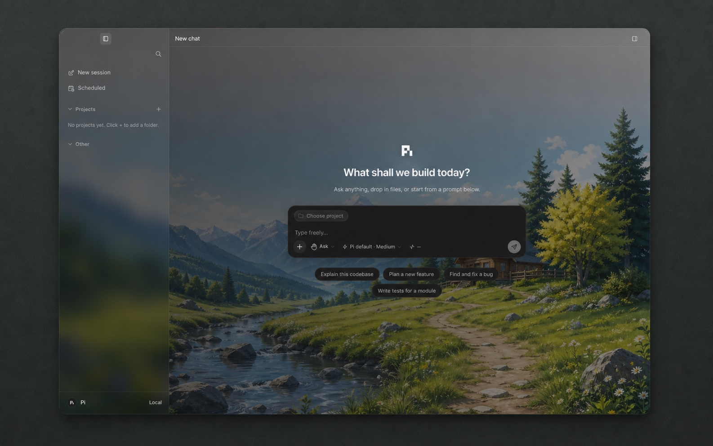
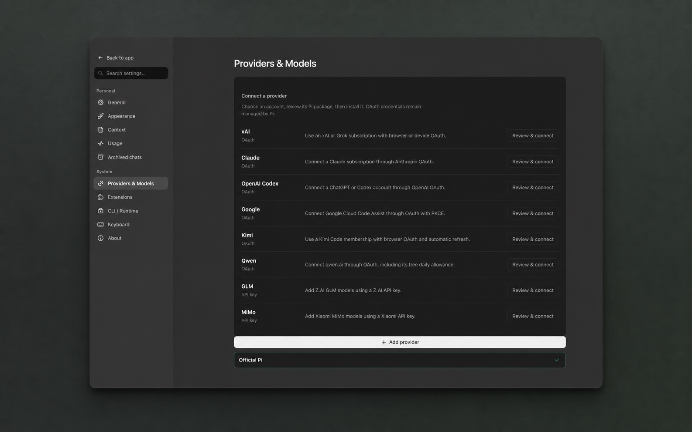
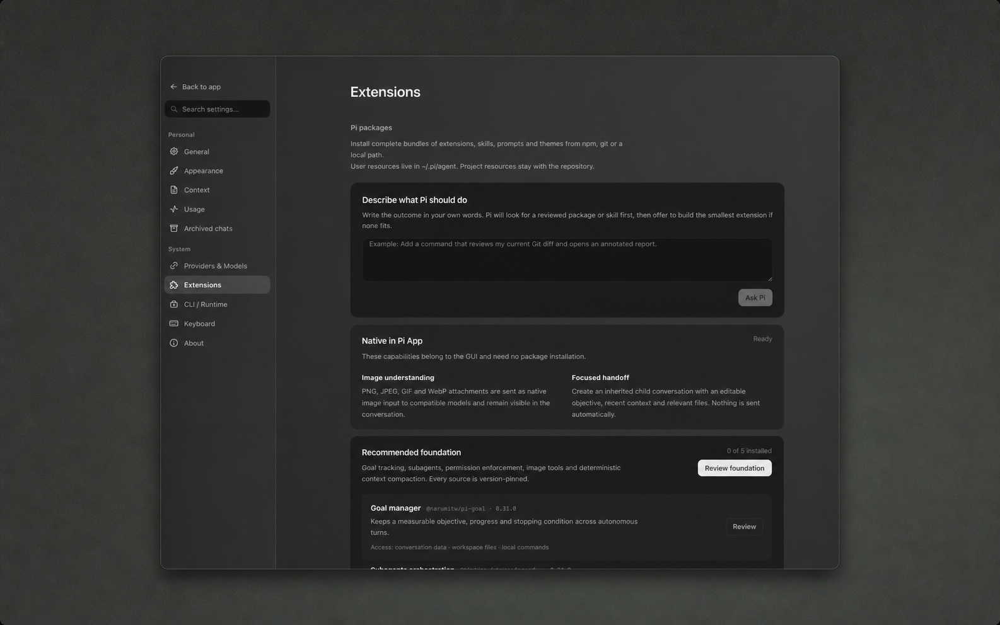

<p align="center">
  
</p>

<h1 align="center">Pi</h1>

<p align="center"><strong>A desktop GUI for <a href="https://pi.dev">Pi</a></strong></p>
<p align="center">
  Projects, sessions, previews and packages — on top of the real Pi agent.
</p>

<p align="center">
  <a href="LICENSE"></a>
  
  
  
  
  
</p>

> [!WARNING]
> **Pi Desktop is alpha software.** Features, data formats and installation
> behavior may change between releases. Keep important work under version
> control and report issues through [GitHub Issues](https://github.com/AJSubrizi/Pi-App/issues).

<p align="center">
  
</p>

<table>
  <tr>
    <td width="50%">
      
    </td>
    <td width="50%">
      
    </td>
  </tr>
  <tr>
    <td align="center"><strong>Providers &amp; Models</strong></td>
    <td align="center"><strong>Describe a capability</strong></td>
  </tr>
</table>

---

## Philosophy

Pi keeps a **small core**. Workflows live in packages — extensions, skills, prompts, themes — not as fake built-ins inside the shell.

This app is the same idea on the desktop:

- The agent is **Pi**, talking over **JSONL RPC** (`pi --mode rpc`)
- Models, auth, sessions and tools stay **owned by Pi**
- The GUI is a workbench: chat, projects, file tree, git changes, browser, packages
- If something is missing, **install a package** or ask Pi to write an extension

It is a **sister project** to [pi.dev](https://pi.dev) — community-built, MIT, not an official Pi product.

```text
┌─────────────────────────┐
│  Pi desktop (this app)  │
│  Tauri · React · Rust   │
└───────────┬─────────────┘
            │  JSONL RPC
            ▼
┌─────────────────────────┐
│  pi --mode rpc          │
│  models · tools · pkgs  │
└─────────────────────────┘
```

---

## What you get

| Area | Details |
|------|---------|
| **Sessions** | Stream chat with the real Pi process — create, resume, abort, compact |
| **Models** | Pick model and thinking level from what Pi exposes |
| **Projects** | Trusted folders, multi-session sidebar, workbench around your repo |
| **Usage** | Private local activity profile with measured tokens and spend, streaks and tool history |
| **Resources** | Files, previews, git changes (stage / discard / commit & push), embedded browser and project terminal |
| **Packages** | Install Pi packages from npm, git or a local path (user or project scope) |
| **Extensions** | Native UI for Pi `select` / `confirm` / `input` / `editor` and status widgets |
| **Remote runtime** | Run Pi through system OpenSSH or an authenticated managed WSS gateway |
| **External control** | Optional local MCP bridge for trusted projects and addressed tasks |
| **Setup** | First-run detection and install path for the Pi CLI |

---

## Requirements

- **Pi CLI** — the agent runtime  
  ```bash
  npm install --global @earendil-works/pi-coding-agent@latest
  pi --version
  ```
- Credentials and providers are configured in Pi itself — see [Pi docs](https://pi.dev/docs/latest)
- To **build from source**: Node 22+, pnpm 9+, Rust stable, and [Tauri prerequisites](https://v2.tauri.app/start/prerequisites/) for your OS

---

## Install (macOS)

Download the `.dmg` from [Releases](https://github.com/AJSubrizi/Pi-App/releases)
(`aarch64` = Apple Silicon, `x64` = Intel).

Builds are **not Apple-notarized** (community MIT app, no paid Developer ID),
so macOS blocks them on first launch. Clearing the download quarantine flag is
the one method that still works on current macOS:

1. Open the DMG and drag **Pi.app** onto **Applications**.
2. Open **Terminal** and run:

   ```bash
   xattr -dr com.apple.quarantine /Applications/Pi.app
   ```

3. Open Pi normally from Applications.

You only do this once. After the first launch Pi opens like any other app.

> [!NOTE]
> **Right-click → Open no longer works.** Apple removed that override in
> macOS 15 Sequoia and tightened it further in macOS 26 Tahoe, so any guide
> still recommending it will fail. System Settings → Privacy & Security →
> *Open Anyway* works only intermittently on Tahoe; the command above is
> reliable.

Prefer not to run a command? [Build from source](#develop) — locally built
apps are never quarantined.

If Pi still refuses to open, clear every extended attribute and launch it
directly:

```bash
xattr -cr /Applications/Pi.app
open /Applications/Pi.app
```

---

## Install (Windows)

The community release is currently unsigned on Windows. SmartScreen may show
an unrecognised-app warning because an OV/EV signing certificate has not been
configured. Verify the download came from the official Releases page before
choosing the Windows confirmation action. The release workflow will gain
certificate-backed signing when a Windows code-signing certificate is funded
and added as a repository secret.

---

## Develop

```bash
pnpm install
pnpm dev          # full desktop app
pnpm dev:ui       # frontend only
```

Checks:

```bash
pnpm typecheck
pnpm test
pnpm build:ui
cd src-tauri && cargo test
```

Optional live RPC smoke test (starts `pi --mode rpc`, no paid prompt):

```bash
cd src-tauri
PI_APP_LIVE_RPC=1 cargo test live_pi_rpc_session_under_30s -- --nocapture
```

---

## Data layout

| Owner | Where |
|-------|--------|
| **This app** | Platform app-data for `dev.pi/pi-app` (override with `PI_APP_HOME`; falls back to `~/.pi-app`) |
| **Pi** | `~/.pi/agent` — config, auth, agent sessions |

The GUI does not copy provider secrets into its package center. Pi remains the source of truth for models and keys.

For remote work, SSH is the recommended default. Advanced deployments can use
the documented [Direct RPC gateway protocol](docs/direct-rpc.md); access tokens
stay in the operating-system keychain.

### External MCP control

Pi Desktop can expose an optional local MCP control plane for clients such as
Codex, Claude or other MCP hosts. Enable it only for a desktop process you
intend to control, then launch Pi Desktop with `PI_APP_ENABLE_MCP=1` and
configure the client to launch the bundled executable with:

```text
pi-app mcp serve
```

The adapter speaks MCP over stdio and connects only to the desktop process on
`127.0.0.1`. It does not open a WAN port, accept arbitrary filesystem paths or
create an untrusted project. External task starts require an existing trusted
project and use `ask` permissions by default, so tool approvals still appear
in the normal Pi Desktop flow. The initial tools cover overview, trusted
projects, session listing/reading, task start/wait and cancellation.

The desktop writes a short-lived authenticated endpoint and a redacted audit
trail in its app-data directory. The audit contains operation, project/session
ids and outcomes; prompts, provider keys and bearer tokens are not written to
it. Treat any MCP client configured this way as a trusted local process because
it can read the sessions belonging to projects that are already trusted in Pi.

To invalidate the current endpoint immediately while leaving the desktop open,
run `pi-app mcp revoke`; `pi-app mcp unrevoke` clears that local marker. A future
desktop launch always rotates the endpoint token.

### Unattended automation

If the desktop process is fully quit, the same local scheduler can run as an
explicit background process:

```text
pi-app automation daemon
```

It uses the existing app-data directory, Pi authentication and append-only
automation ledger. It has no UI and opens no network listener. Run it under the
user's normal service manager when unattended schedules must survive a full
desktop quit.

---

## Packages

**Settings → Packages** manages Pi packages the same way the CLI does. **Settings → Skills** lists installed skills, lets you enable or disable them, and accepts new npm, git or local skill sources:

- npm · git · local path  
- user-wide or current project  
- extensions, skills, prompts, themes  

Plan modes, gates, sub-agents and other workflows should come from packages — not from hard-coded shell features.

---

## Acknowledgements

Pi Desktop is an independent implementation. No source code or product assets
from external desktop applications are bundled with this project.

Agent activity animations are powered by
[Thinking Orbs](https://orbs.jakubantalik.com/) by
[Jakub Antalik](https://github.com/JakubAntalik), distributed under the
[MIT License](https://github.com/JakubAntalik/thinking-orbs/blob/main/LICENSE).

Product workflow research also considered the public documentation of
[T3 Code](https://github.com/pingdotgg/t3code) and
[Synara](https://github.com/Emanuele-web04/synara). Pi Desktop remains an
independent implementation: no source code or product assets from those
projects are bundled here.

---

## License

[MIT](LICENSE)

Unofficial desktop shell for [Pi](https://pi.dev) · runtime by [earendil-works/pi](https://github.com/earendil-works/pi)
